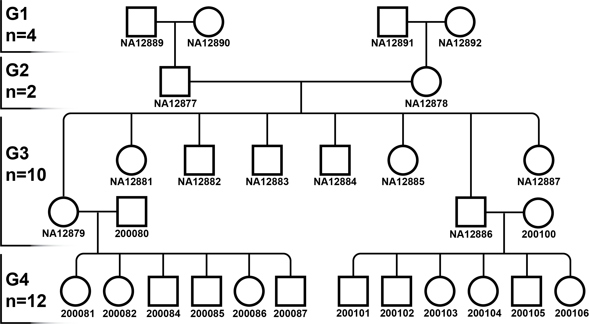

# Pedigree Explorer

**A framework for detection and visualisation of identical-by-descent (IBD) regions in human familial sequencing data, supporting the analysis of both phased and un-phased data.**



---

## Abstract

Identification of shared chromosomal regions between related individuals is fundamental for understanding inheritance patterns and identifying genetic factors underlying hereditary disease. The Pedigree Explorer project develops an end-to-end pipeline for detection and visualisation of identity-by-descent (IBD) regions in human familial sequencing data. Three IBD detection tools — **IBIS**, **TRUFFLE**, and **RaPID** — are integrated into a containerised pipeline supporting both un-phased short-read (Illumina) and block-phased long-read (PacBio) data. A custom PyQt5 GUI enables intuitive visualisation of detected IBD segments on chromosome ideograms, with three-way overlap detection to identify regions shared across multiple sample pairs.

The framework was validated on the publicly available Platinum Pedigree Data (PPD) and applied to a urothelial cancer case study comprising three related individuals with familial bladder cancer. Results demonstrate successful IBD detection across relationship classes — from full siblings (~50% expected) to second cousins once removed (~1.56% expected) — providing a reproducible workflow for hereditary disease gene mapping.

---

## Table of Contents

1. [Introduction](#introduction)
2. [Pedigree Information](#pedigree-information)
3. [Source Data](#source-data)
4. [Repository Structure](#repository-structure)
5. [Data Preprocessing](#data-preprocessing)
6. [IBD Detection Tools](#ibd-detection-tools)
   - [IBIS](#ibis)
   - [TRUFFLE](#truffle)
   - [RaPID](#rapid)
7. [GUI](#gui)
8. [Conclusion](#conclusion)
9. [Citation & References](#citation--references)
10. [Institution Details](#institution-details)
11. [License](#license)

---

## Introduction

Identity-by-descent (IBD) refers to genomic segments inherited from a recent common ancestor without intervening recombination. Detection of these shared regions is foundational for relationship inference, population genetics, and disease gene mapping. In the context of familial disease studies, IBD analysis can substantially reduce the search space for pathogenic variants by identifying chromosomal regions shared among affected individuals — regions that are strong candidates for harbouring inherited disease-causing mutations.

Three IBD detection algorithms with complementary strengths have been integrated into the Pedigree Explorer framework:

- **IBIS** — Fast, scalable, un-phased detection using IBS markers and centiMorgan-based filtering
- **TRUFFLE** — Phase-free detection with separate IBD1/IBD2 segment calls and built-in error correction
- **RaPID** — Hash-based detection using positional Burrows-Wheeler transform on phased data

The use of multiple tools enables cross-validation of IBD calls, providing higher confidence in regions identified as shared across methods.

---

## Pedigree Information

### Platinum Pedigree (PPD)

A multi-generational reference family from the publicly available Platinum Pedigree Data (Kronenberg et al., 2025). Used as a benchmark dataset with known relationships for validation.

- **Subset analysed:** Generation 3 sibling trio
- **Samples:** NA12879, NA12882, NA12886
- **Relationship:** Full siblings (sharing parents NA12877 and NA12878)
- **Expected IBD sharing:** ~50% genome (kinship coefficient 2φ = 0.5)

### Urothelial Cancer Case Study (IHCAPX8)

A familial case study comprising three related individuals affected by urothelial (bladder) cancer. Provided by the project supervisors and restricted under UK GDPR regulations due to identifiable human genetic and clinical information.

| Sample | Generation | Cancer history | Relationship |
|--------|------------|----------------|--------------|
| IHCAPX8-1 | III | Bladder cancer (age 48) | First cousin to IHCAPX8-2 |
| IHCAPX8-2 | III | Prostate (46) + Bladder cancer (57) | First cousin to IHCAPX8-1 |
| IHCAPX8-3 | IV | Bladder cancer (age 50) | Second cousin once removed to both |

**Expected IBD sharing:**
- IHCAPX8-1 ↔ IHCAPX8-2: ~12.5% (first cousins)
- IHCAPX8-1 ↔ IHCAPX8-3: ~1.56% (second cousins once removed)
- IHCAPX8-2 ↔ IHCAPX8-3: ~1.56% (second cousins once removed)

*Reference: ISOGG (2024) Autosomal DNA statistics*

---

## Source Data

Both datasets provide un-phased short-read (Illumina) and block-phased long-read (PacBio) data, enabling comparative analysis across sequencing platforms.

| Dataset | Source | Format | Access | Reference |
|---------|--------|--------|--------|-----------|
| **PPD** | Public (AWS S3) | Illumina + PacBio VCFs | Open via AWS-CLI | Kronenberg et al. (2025) |
| **IHCAPX8** | Cranfield supervisors | Illumina + PacBio VCFs | Restricted (UK GDPR) | — |

All data is mapped to the **GRCh38** reference (Schneider et al., 2017). Analyses are restricted to autosomal chromosomes 1–22, excluding mitochondrial and sex chromosomes to reduce analytical complexity, improve consistency across tools, and focus the workflow on directly comparable genomic regions.

---

## Repository Structure

```
pedigree-explorer/
├── README.md                       # This file
├── LICENSE
├── .gitignore
│
├── Preprocessing_Pipeline/         # Data preparation
│   ├── README.md
│   ├── Scripts/
│   │   ├── Unphased/               # Illumina pipeline
│   │   └── Phased/                 # PacBio pipeline
│   ├── config/                     # Singularity container definitions
│   └── examples/
│
├── IBD_Analysis/                   # IBD detection tools
│   ├── IBIS/
│   │   ├── README.md
│   │   └── Scripts/
│   ├── TRUFFLE/
│   │   ├── README.md
│   │   └── Scripts/
│   └── RaPID/
│       ├── README.md
│       └── Scripts/
│
├── GUI/                            # PyQt5 visualisation application
│   ├── README.md
│   ├── Usr Manual.pdf
│   ├── Scripts/
│   ├── images/
│   │   ├── ibis/
│   │   ├── rapid/
│   │   └── truffle/
│   └── data/
│       ├── ibis/
│       ├── rapid/
│       └── truffle/
│
│
├── docs/                           # Project documentation
│   ├── methods.md
│   ├── results.md
│   └── references.md
│
└── images/                         # Project images
    └── platinum-pedigree-tree.png
```

---

## Data Preprocessing

A preprocessing pipeline prepares short-read (Illumina) and long-read (PacBio) genotype data for downstream IBD analysis. The pipeline is designed for HPC clusters with `qsub`-compatible (PBS-style) job schedulers and uses Singularity/Apptainer containers to manage software dependencies.

### Pipeline Overview

| Pipeline | Steps |
|----------|-------|
| **Illumina (un-phased)** | Filter → PLINK conversion → Genetic map annotation |
| **PacBio (phased)** | Per-sample filter → Merge → Chromosome split |

**Tools used:** bcftools, HTSlib, PLINK2, IBIS (for genetic map utility)

### Quick Start

```bash
# Build the Singularity container
singularity build my_container.sif Preprocessing_Pipeline/config/Complete_Container.def

# Run Illumina pipeline (in order)
qsub Preprocessing_Pipeline/Scripts/Unphased/s01_Illumina_Filter.sh
qsub Preprocessing_Pipeline/Scripts/Unphased/s02_Illumina_PLINK_Conversion.sh
qsub Preprocessing_Pipeline/Scripts/Unphased/s03_Illumina_Add_Genetic_Map.sh

# Run PacBio pipeline (in order)
qsub Preprocessing_Pipeline/Scripts/Phased/01_PacBio_Filter.sh
qsub Preprocessing_Pipeline/Scripts/Phased/02_PacBio_Split.sh
```

See [Preprocessing_Pipeline/README.md](Preprocessing_Pipeline/README.md) for detailed instructions.

---

## IBD Detection Tools

Three IBD detection tools are applied to the preprocessed data, each suited to different input types and detection strategies:

| Tool | Type | Phased? | Filtering basis | Output |
|------|------|---------|-----------------|--------|
| **IBIS** | IBS-based | No (un-phased) | cM (genetic distance) | `.seg`, `.coef` |
| **TRUFFLE** | IBS-based | No (un-phased) | Mb (physical distance) | `.segments` |
| **RaPID** | PBWT-based | Yes (phased) | cM (genetic distance) | `.seg` |

### IBIS

**Version:** 1.20.9  
**Input:** PLINK binary format (`.bed`/`.bim`/`.fam`) with genetic distances  
**Strengths:** Fast, scalable, robust cM-based filtering, mutually exclusive IBD1/IBD2 reporting

IBIS detects IBD regions by scanning the genome for contiguous regions of high IBS between pairs of individuals, using a window-based approach that tolerates limited mismatches. Three parameter configurations are tested: **sensitive**, **literature-recommended (Seidman et al., 2020)**, and **strict**.

See [IBD_Analysis/IBIS/README.md](IBD_Analysis/IBIS/README.md) for full documentation.

### TRUFFLE

**Version:** 1.38  
**Input:** Multi-sample VCF (`.vcf.gz`)  
**Strengths:** No genetic map required, separate IBD1/IBD2 detection, built-in error correction (up to 1%)

TRUFFLE detects IBD by identifying long stretches of consecutive IBS markers between pairs of individuals. It does not require haplotype phasing or a population genetic map, making it suitable for rapid deployment across populations. Parameter optimisation (`-L` length multiplier and `--ibs1markers`/`--ibs2markers` thresholds) is required for distant relatives in WGS data.

See [IBD_Analysis/TRUFFLE/README.md](IBD_Analysis/TRUFFLE/README.md) for full documentation.

### RaPID

**Version:** 1.7  
**Input:** Phased per-chromosome VCF files  
**Strengths:** Leverages phased haplotypes, hash-based for high speed, suitable for long-read data

RaPID detects IBD using a positional Burrows-Wheeler transform (PBWT) approach on phased data. In this project, RaPID is applied to PacBio long-read data after splitting into per-chromosome VCFs.

See [IBD_Analysis/RaPID/README.md](IBD_Analysis/RaPID/README.md) for full documentation.

---

## GUI

The **Pedigree Explorer GUI** (IBDogram Viewer) is a PyQt5-based desktop application for visualising IBD segments detected by IBIS, TRUFFLE, and RaPID. It accepts BED files as input and renders detected IBD regions on a chromosome ideogram with cytoband annotations.

### Features

- **Chromosome ideogram** with toggleable cytoband display (centromeres shown in grey)
- **BED file loading** with automatic ideogram population
- **Pairwise IBD segments table** — click any row to open a region popup with gene annotations
- **Three-way overlap detection** — identifies regions shared across all three pairwise comparisons in a trio
- **File summary box** — displays filename, number of IBD segments, and number of comparisons
- **Highlight dropdown** — focus the ideogram on a specific pairwise comparison
- **Region popup** — zoomed region view with gene table (gene name, location, Ensembl ID), customisable colours, and CSV export
- **Image export** — save ideograms and region diagrams as PNG

### Quick Start

1. Download the executable file and BED files of chromosomal gene coordinates from the GitHub repository (both must be in the same folder)
2. Launch the executable (loading may take up to 30 seconds depending on system specifications)
3. Click **File → Open File** to load a BED file
4. The ideogram will automatically populate with regions from the BED file
5. Save ideograms via **File → Save Image** or the save icon in the ideogram toolbar

### Input Format

The GUI expects four-column BED files:

```
chromosome  start_bp  end_bp  sample_pair_name
```

Conversion scripts are provided in each IBD tool's folder (`IBD_Analysis/IBIS/`, `IBD_Analysis/TRUFFLE/`, `IBD_Analysis/RaPID/`) to convert tool-specific output formats (`.segments`, `.seg`) into this BED format.

### Documentation

-  [GUI/README.md](GUI/README.md) — Setup instructions, dependencies, and developer notes
-  [GUI/User_Manual.pdf](GUI/User_Manual.pdf) — Complete user manual with screenshots and feature walkthroughs

---

## Conclusion

This pipeline establishes a reproducible end-to-end framework for IBD detection and visualisation in pedigree sequencing data. Three complementary IBD detection algorithms were successfully integrated, enabling cross-validation of detected segments. **IBIS and TRUFFLE** demonstrated successful detection of shared regions in Illumina data when parameters were appropriately tuned for the dataset's marker density and relationship distances. **RaPID** showed several technical limitations on the long-read data tested, including challenges with phase-set compatibility and parameter optimisation, suggesting it may underperform when capturing the full extent of IBD sharing in some long-read scenarios.

The custom PyQt5 GUI provides an intuitive interface for clinical and research users to visualise IBD overlaps and identify candidate disease-associated regions, with three-way overlap detection particularly suited to small-pedigree disease mapping studies.

### Capabilities

- Containerised, reproducible pipeline deployable on HPC clusters
- Cross-platform sequencing support (Illumina short-read + PacBio long-read)
- Cross-tool validation through three independent IBD detection algorithms
- Interactive visualisation with overlap detection and gene annotation

### Limitations

- **Phase-set information removed** from PacBio VCFs to ensure RaPID compatibility, reducing the ability to leverage block-phased structure
- **Restriction to biallelic SNPs** excludes indels and multiallelic variants that may carry additional informative signal
- **Autosomal-only analysis** — variants on sex chromosomes and mitochondrial DNA are not assessed
- **TRUFFLE detection power** drops below 5% for segments under 4 Mb, limiting detection of very distant relationships
- **RaPID parameter estimation** challenges (division-by-zero errors) prevented full optimisation

### Future Directions

- Integration of a workflow management system (e.g. Nextflow) for improved reproducibility and scalability
- Inclusion of indels and multiallelic variants for broader signal capture
- Expanded RaPID troubleshooting and parameter optimisation
- Enhanced GUI features (relaxed overlap detection, customisable colour schemes, save-region functionality)
- Application to additional familial disease cohorts to validate generalisability

This pipeline could be applied in future research to identify candidate disease-causing variants in patients with hereditary conditions, supporting the discovery of genetic factors underlying inherited diseases.

---

## Citation & References

### Tools

> **IBIS:** Seidman, D.N., Shenoy, S.A., Kim, M., Babu, R., Woods, I.G., Dyer, T.D., Lehman, D.M., Curran, J.E., Duggirala, R., Blangero, J., & Williams, A.L. (2020). Rapid, phase-free detection of long identity-by-descent segments enables effective relationship classification. *The American Journal of Human Genetics*, 106(4), 453–466.

> **TRUFFLE:** Dimitromanolakis, A., Paterson, A.D., & Sun, L. (2019). Fast and accurate shared segment detection and relatedness estimation in un-phased genetic data via TRUFFLE. *The American Journal of Human Genetics*, 105(1), 78–88.

> **RaPID:** Naseri, A., Liu, X., Tang, K., Zhang, S., & Zhi, D. (2019). RaPID: ultra-fast, powerful, and accurate detection of segments identical by descent (IBD) in biobank-scale cohorts. *Genome Biology*, 20, 143.

### Data and References

> **Platinum Pedigree:** Kronenberg, Z.N., et al. (2025). Platinum Pedigree: A high-quality reference dataset for human pedigree analysis.

> **Reference Genome:** Schneider, V.A., et al. (2017). Evaluation of GRCh38 and de novo haploid genome assemblies demonstrates the enduring quality of the reference assembly. *Genome Research*, 27, 849–864.

> **bcftools:** Danecek, P., et al. (2021). Twelve years of SAMtools and BCFtools. *GigaScience*, 10(2), giab008.

> **ISOGG:** International Society of Genetic Genealogy (2024). Autosomal DNA statistics. Retrieved from https://isogg.org/wiki/Autosomal_DNA_statistics

---

## Institution Details

**Cranfield University**  
Supervisor: Dr Alexey Larionov  
Course Lead: Dr Maria Anastasiadi  
Support staff: Sajad Falsafi Zadeh  
Course: MSc Applied Bioinformatics 2025-26  
Project: I-SEM-GRPP-25-A25 BIX

---

## License

MIT License — see [LICENSE](LICENSE) for details.
